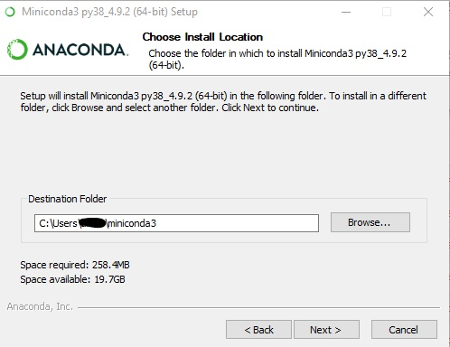
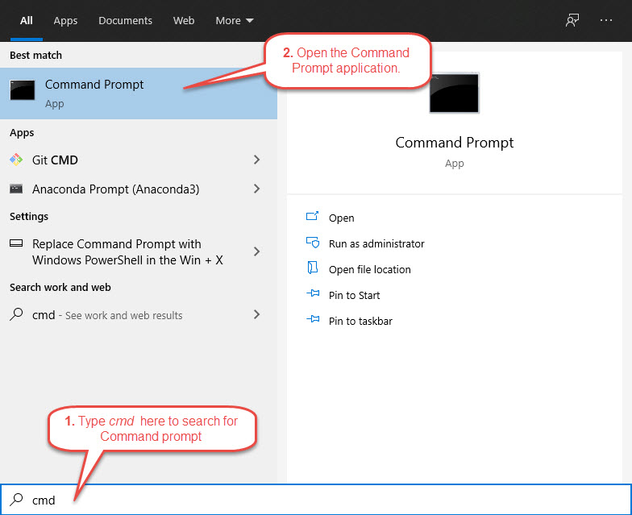
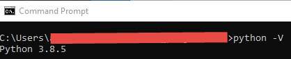

## Miniconda

Follow these steps to install conda and Python.

1. Download **Python 3.8** version of miniconda installer that matches your operating system (e.g., Windows 64-bit) [here](https://docs.conda.io/en/latest/miniconda.html).
2. Run the installer. When prompted, choose the following options:

- **Destination Folder:** Accept the default folder or enter a different one.

  

- **Install for:** Choose *Just Me*.

  

- **Advanced Options:** This is **important!** Check *Add Miniconda3 to my PATH environment variable*.

  

3. When completed, check if the installation was successful. Follow these steps:
  - Open Command Prompt application on your desktop.
  
  
  - On the command line, type `python -V`. **Note**,  `-V` is **case sensitive**. If you see `Python 3.8.5`, congrats! You have successfully installed Python. 
  

### Links
Go back to the main [Installation Guide](./readme.md). 
Proceed to [Required Packages](./requirements.md).

