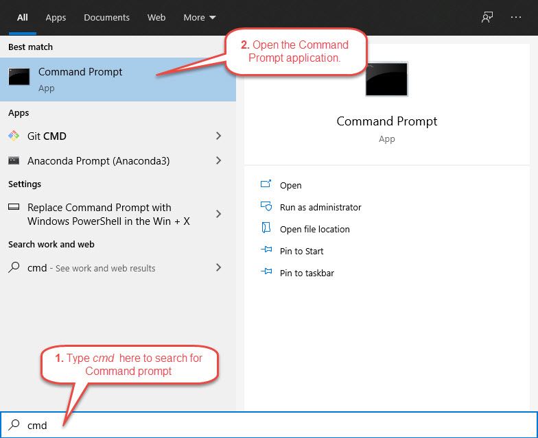
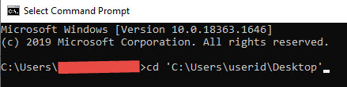

# Required Packages

Once you have successfully installed Python and conda (see [Miniconda](./miniconda.md) installation guide), follow the steps below to download the Python packages **required for this project**. 

1. Create a text file called **requirements.txt** on your desktop.
2. Copy the list of packages on this [file](https://raw.githubusercontent.com/joanzaldivar/sentiment-analysis/main/installation/requirements.txt) to **your** requirements file and save it.
3. Open Command Prompt application on your desktop. 
  
4.  Inside Command Prompt, navigate to **your desktop folder** where your requirements file is located by typing `cd <your desktop path here>` and press **enter**. 
  
5. Then, type `conda config --set ssl_verify no`.
6. Then, type `conda install -c conda-forge --file requirements.txt` and press **enter**.
7. When prompted to proceed, type `y` and press **enter**.
8. The system will start downloading the packages. When complete, you will see the message ***Executing transaction: done***.
9. Finally, type `conda config --set ssl_verify yes` and press **enter**. 

Congratulations! You've completed the installation of required packages.

### Links
Go back to the main [Installation Guide](./readme.md). 
Go back to [Miniconda](./miniconda.md).
